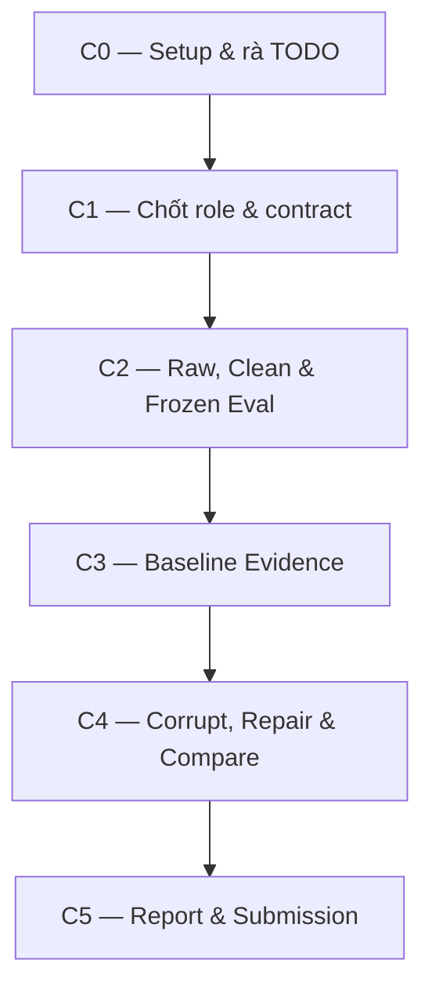
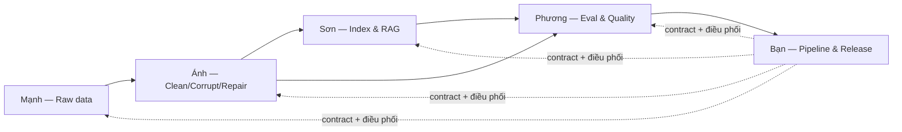

# PHÂN CÔNG CÔNG VIỆC NHÓM — RAG DATA QUALITY LAB

> Tài liệu này là nguồn phân công chính thức của nhóm. Mỗi thành viên phải đọc phần **Quy tắc chung**, sau đó sao chép prompt tại phần vai trò của mình để bắt đầu làm việc với AI.

## 1. Thành viên và phạm vi sở hữu

| Role | Thành viên | Vai trò | Module sở hữu chính | Đầu ra bàn giao |
|---|---|---|---|---|
| R1 | Bạn | Integration & Release Owner | `src/pipelines/phase1.py`, `src/pipelines/corruption_flow.py`, `script/`, cấu hình chung | Pipeline chạy end-to-end và bài nộp hoàn chỉnh |
| R2 | Mạnh | Source Ingestion Owner | `src/ingestion/crossref.py` | Raw response và raw records có thể tái sử dụng |
| R3 | Ánh | Cleaning, Corruption & Repair Owner | `src/ingestion/cleaning.py`, `src/ingestion/corruption.py` | Clean, corrupted và repaired datasets |
| R4 | Sơn | Retrieval & RAG Owner | `src/retrieval/` | ChromaDB index, câu trả lời và retrieved document IDs |
| R5 | Phương | Evaluation, Observability & Reporting Owner | `src/evaluation/`, `src/observability/` | Frozen test set, metrics, quality checks và báo cáo |

## 2. Quy tắc làm việc chung

1. Mỗi người chỉ sửa module mình sở hữu. Nếu cần sửa module của người khác, phải trao đổi trước.
2. Không tự ý đổi data contract sau Checkpoint C1.
3. `paper_id` phải giữ nguyên xuyên suốt raw → clean → index → test set → answers.
4. `data/eval/test_set.json` phải được đóng băng ở C2. C3 và C4 chỉ được đọc lại, không sinh lại hoặc sửa nội dung.
5. Baseline, corrupted và repaired phải dùng cùng test set, chunking strategy, embedding model, `top_k`, LLM model và evaluator.
6. Corruption không được sửa raw snapshot hoặc clean baseline.
7. Repair phải dựng lại từ `data/raw/crossref_records.json`, không fetch API lần nữa và không sửa trực tiếp corrupted CSV.
8. Không commit `.env`, API key, `chroma_db/` lớn hoặc dữ liệu không được yêu cầu.
9. Không điền metrics giả vào báo cáo; mọi số liệu phải lấy từ JSON sinh ra khi chạy thật.
10. Trước khi bàn giao, mỗi người phải chạy test hoặc lệnh kiểm tra liên quan và ghi lại minh chứng.

Quy ước retrieval dùng chung từ C1 trở đi:

- Chunking strategy: document-level chunking, mỗi clean paper là một document/chunk duy nhất.
- Chunk content: dùng nguyên `text_for_embedding` từ clean dataset.
- Document identity: Chroma metadata phải có `paper_id`; retrieval hit đối chiếu bằng `paper_id`.
- Embedding model: `sentence-transformers/all-MiniLM-L6-v2`.
- Retrieval `top_k`: `4`.
- Không đổi chunking strategy hoặc `top_k` riêng cho một trạng thái khi so sánh baseline/corrupted/repaired.

## 3. Data contracts bắt buộc

### 3.1 Raw record — R2 bàn giao cho R3

```json
{
  "paper_id": "10.xxxx/example",
  "doi": "10.xxxx/example",
  "title": "Paper title",
  "abstract": "Raw abstract",
  "description": "",
  "authors": [{"given": "Van", "family": "Nguyen"}],
  "categories": ["Machine Learning"],
  "published": {"date-parts": [[2025, 1, 20]]},
  "url": "https://doi.org/...",
  "source": "crossref",
  "fetched_at": "2026-08-06T10:00:00Z"
}
```

### 3.2 Clean record — R3 bàn giao cho R4 và R5

Các trường bắt buộc:

```text
paper_id, title, summary, published, authors_joined,
categories_joined, age_days, text_for_embedding, abs_url, pdf_url
```

Quy tắc `text_for_embedding`:

```text
Title: <title>
Authors: <authors_joined>
Categories: <categories_joined>
Summary: <summary>
```

R4 sẽ index toàn bộ `text_for_embedding` như một document/chunk duy nhất cho mỗi `paper_id`.

### 3.3 Evaluation sample — R5 quản lý

```json
{
  "id": "q1",
  "question_type": "factual",
  "question": "Câu hỏi?",
  "ground_truth": "Câu trả lời chuẩn",
  "ground_truth_doc_ids": ["paper-id"]
}
```

### 3.4 Agent result — R4 bàn giao cho R5

```json
{
  "answer": "Câu trả lời",
  "retrieved_doc_ids": ["paper-id"],
  "contexts": ["Context được sử dụng"],
  "provider": "provider-name",
  "model": "model-name"
}
```

### 3.5 Aggregate metrics — R5 bàn giao cho R1

```json
{
  "dataset_state": "baseline",
  "question_count": 10,
  "retrieval_hit_rate": 0.9,
  "mean_token_f1": 0.75,
  "judge_accuracy": 0.8,
  "mean_judge_score": 4.1
}
```

### 3.6 Retrieval configuration — R1/R4/R5 cùng tuân thủ

```json
{
  "chunking_strategy": "document_level",
  "chunk_source_column": "text_for_embedding",
  "document_id": "paper_id",
  "embedding_model": "sentence-transformers/all-MiniLM-L6-v2",
  "top_k": 4
}
```

Các metric retrieval phải dùng cấu hình này cho cả `baseline`, `corrupted` và `repaired`.

## 4. Sơ đồ checkpoint của toàn nhóm



Không chuyển checkpoint nếu artifact bắt buộc của checkpoint trước chưa tồn tại hoặc chưa đạt điều kiện nghiệm thu.

## 5. Sơ đồ bàn giao giữa các thành viên



## 6. Ma trận công việc qua từng checkpoint

| Checkpoint | R1 — Huy | R2 — Mạnh | R3 — Ánh | R4 — Sơn | R5 — Phương |
|---|---|---|---|---|---|
| C0 | Setup repo, chia TODO, quy ước Git | Rà Crossref và kết nối API | Rà cleaning/corruption | Rà retrieval, ChromaDB, LLM | Rà eval, metrics, quality |
| C1 | Chốt contract và bảng phân công | Chốt Raw Schema | Chốt Clean Schema | Chốt retrieval/agent schema | Chốt eval/metrics schema |
| C2 | Kiểm tra tích hợp raw → clean → eval | Fetch và lưu hai raw artifacts | Tạo clean CSV/JSON | Build/query index thử | Tạo và đóng băng test set |
| C3 | Ghép và chạy baseline pipeline | Xác minh source lineage | Xác minh clean baseline | Build baseline index, chạy agent | Tính metrics, quality, report |
| C4 | Ghép corruption flow ba trạng thái | Bảo vệ raw snapshot | Corrupt và repair từ raw | Rebuild corrupted/repaired index | Evaluate và so sánh 3 trạng thái |
| C5 | Chạy sạch, tổng hợp và release | Viết phần ingestion | Viết phần data lifecycle | Viết phần retrieval/RAG | Viết phần eval/observability |

---

# 7. ROLE 1 — BẠN: INTEGRATION & RELEASE OWNER

## Phạm vi chịu trách nhiệm

- `src/pipelines/phase1.py`
- `src/pipelines/corruption_flow.py`
- `script/run_phase1.py`
- `script/run_corruption_flow.py`
- Cấu hình, tích hợp, kiểm tra end-to-end và `report/group_report.md`

## Công việc theo checkpoint

### C0

- Kiểm tra Python, dependencies và cấu trúc repo.
- Tìm toàn bộ `TODO(student)` và `NotImplementedError`.
- Tạo quy ước branch/commit và giao đúng file cho từng người.
- Xác nhận hai entrypoint có thể import.

### C1

- Chủ trì chốt 5 data contracts trong tài liệu này.
- Điền bảng thành viên vào `report/group_report.md`.
- Chốt tên artifact, ba trạng thái và điều kiện bàn giao.

### C2

- Chạy kiểm tra luồng Crossref → raw → clean → frozen test set.
- Xác nhận tất cả `ground_truth_doc_ids` có trong clean data.
- Ngăn pipeline ghi đè test set đã tồn tại.

### C3

- Ghép baseline pipeline theo đúng thứ tự.
- Dừng rõ ràng nếu clean data/test set rỗng hoặc thiếu ground-truth document.
- Nếu LLM judge lỗi, vẫn lưu retrieval hit rate và Token F1.

### C4

- Ghép corrupted → evaluate → repair from raw → evaluate → compare.
- Giữ cấu hình đánh giá công bằng giữa ba trạng thái.
- Không cho repair gọi lại Crossref API.

### C5

- Chạy lại từ môi trường sạch.
- Kiểm tra đầy đủ artifact, report, individual report và secrets.
- Đối chiếu Markdown report với JSON metrics thực tế.

## Prompt khởi động dành cho R1

```text
Integration & Release Owner của RAG Data Quality Lab.

Phạm vi tôi sở hữu:
- src/pipelines/phase1.py
- src/pipelines/corruption_flow.py
- script/run_phase1.py
- script/run_corruption_flow.py
- cấu hình tích hợp và report/group_report.md

Hãy làm việc theo checkpoint [C0/C1/C2/C3/C4/C5]. Trước khi sửa code:
1. Đọc cấu trúc repo và các interface hiện có.
2. Không tự ý đổi data contract đã chốt.
3. Chỉ sửa file trong phạm vi của R1, trừ khi tôi xác nhận mở rộng.
4. Nêu rõ input cần nhận từ Mạnh, Ánh, Sơn, Phương.
5. Xử lý lỗi thiếu/rỗng artifact bằng thông báo rõ ràng.
6. Không ghi đè data/eval/test_set.json sau khi đã đóng băng.
7. C3 và C4 phải dùng cùng test set, top-k, embedding model và evaluator.
8. Sau khi sửa, chạy lệnh kiểm tra phù hợp và liệt kê artifact được tạo.

Mục tiêu checkpoint hiện tại: [điền mục tiêu].
Trạng thái/artifact hiện có: [điền thông tin].
Hãy đề xuất kế hoạch ngắn, sau đó triển khai và báo cáo Definition of Done.
```

---

# 8. ROLE 2 — MẠNH: SOURCE INGESTION OWNER

## Phạm vi chịu trách nhiệm

- `src/ingestion/crossref.py`
- `data/raw/crossref_response.json`
- `data/raw/crossref_records.json`

## Công việc theo checkpoint

### C0–C1

- Rà TODO trong `crossref.py`, thử kết nối Crossref.
- Chốt Raw Schema, cách tạo `paper_id`, query và filter.
- Bàn giao contract cho Ánh.

### C2

- Gọi `https://api.crossref.org/works` theo chủ đề đã chốt.
- Chỉ parse bản ghi đủ title và abstract/description.
- Có timeout, retry cho lỗi tạm thời và exponential backoff.
- Lưu response thô và danh sách `PaperRecord` phẳng.
- Đảm bảo raw snapshot đủ để repair offline.

### C3

- Xác minh source lineage, số lượng response/raw/clean.
- Kiểm tra retry không gây duplicate.
- Cung cấp query, thời điểm fetch và số record cho report.

### C4–C5

- Bảo vệ raw snapshot, đảm bảo corruption không sửa `data/raw/`.
- Hỗ trợ repair đọc raw đã lưu, không fetch lại API.
- Viết phần ingestion và vai trò raw snapshot trong báo cáo cá nhân.

## Prompt khởi động dành cho Mạnh

```text
Bạn đang hỗ trợ tôi với vai trò R2 — Source Ingestion Owner của RAG Data Quality Lab.

Tôi chỉ sở hữu src/ingestion/crossref.py và hai artifact:
- data/raw/crossref_response.json
- data/raw/crossref_records.json

Hãy làm checkpoint [C0/C1/C2/C3/C4/C5]. Yêu cầu:
1. Không sửa cleaning, retrieval, evaluation hoặc pipeline nếu chưa được đồng ý.
2. Dùng Crossref /works, timeout hợp lý, retry/backoff cho 429/5xx.
3. Lưu response HTTP thô để audit và records đã parse theo Raw Schema.
4. paper_id phải ổn định, không dùng số thứ tự của danh sách.
5. Không làm sạch HTML/XML ở tầng raw quá mức cần thiết.
6. Raw records phải đủ dữ liệu để Ánh repair mà không gọi lại API.
7. Không làm lộ key hoặc ghi secret vào log.
8. Sau khi làm, kiểm tra JSON hợp lệ, số lượng bản ghi và duplicate paper_id.

Đầu vào hiện có: [điền].
Mục tiêu cụ thể: [điền].
Hãy triển khai trong đúng phạm vi, chạy kiểm tra và viết phần bàn giao cho Ánh/R1.
```

---

# 9. ROLE 3 — ÁNH: CLEANING, CORRUPTION & REPAIR OWNER

## Phạm vi chịu trách nhiệm

- `src/ingestion/cleaning.py`
- `src/ingestion/corruption.py`
- Clean, corrupted và repaired datasets
- `data/results/corruption_log.json`

## Công việc theo checkpoint

### C0–C1

- Rà TODO và phụ thuộc của cleaning/corruption.
- Chốt Clean Schema với Sơn và Phương.

### C2

- Bỏ bản ghi thiếu title hoặc summary dưới 100 ký tự.
- Loại HTML/XML, chuẩn hóa khoảng trắng.
- Gộp authors/categories, chuẩn hóa ngày và tính `age_days`.
- Tạo `text_for_embedding` đúng contract, loại duplicate theo `paper_id`.
- Lưu `papers_clean.csv` và `papers_clean.json`.

### C3

- Xác minh clean baseline không có trường bắt buộc rỗng, duplicate ID, ngày sai hoặc embedding text rỗng.
- Đảm bảo chạy cleaning lặp lại cho kết quả ổn định.

### C4

- Tạo ít nhất ba corruption scenario, seed cố định.
- Corruption phải chạm ít nhất một frozen ground-truth document.
- Không sửa clean baseline hoặc raw snapshot.
- Ghi log record, trường, trước/sau và scenario.
- Repair bằng cách chạy cleaning chuẩn lại từ raw snapshot.

### C5

- Viết cleaning rules, clean schema, corruption scenarios, seed, affected records và repair process.

## Prompt khởi động dành cho Ánh

```text
Bạn đang hỗ trợ tôi với vai trò R3 — Cleaning, Corruption & Repair Owner.

Phạm vi tôi sở hữu:
- src/ingestion/cleaning.py
- src/ingestion/corruption.py
- data/clean/papers_clean.csv, papers_clean.json, papers_corrupted.csv
- data/results/corruption_log.json

Checkpoint hiện tại: [C0/C1/C2/C3/C4/C5]. Yêu cầu:
1. Nhận raw records từ Mạnh và tuân thủ Raw/Clean Schema đã chốt.
2. Không sửa retrieval, evaluation hoặc pipeline.
3. Cleaning phải deterministic và giữ paper_id ổn định.
4. Tạo `text_for_embedding` đúng mẫu `Title`, `Authors`, `Categories`, `Summary` đã chốt.
5. Corruption dùng seed cố định, tạo file mới và chạm ground_truth_doc_ids.
6. Không sửa raw snapshot, clean baseline hoặc frozen test set.
7. Repair phải chạy lại cleaning từ data/raw/crossref_records.json.
8. Sau khi làm, chạy quality checks phù hợp và bàn giao datasets cho Sơn, Phương, R1.

Đầu vào hiện có: [điền].
Mục tiêu cụ thể: [điền].
Hãy kiểm tra contract, triển khai đúng phạm vi và báo cáo artifact cùng Definition of Done.
```

---

# 10. ROLE 4 — SƠN: RETRIEVAL & RAG OWNER

## Phạm vi chịu trách nhiệm

- `src/retrieval/embeddings.py`
- `src/retrieval/index.py`
- `src/retrieval/llm.py`
- `src/retrieval/agent.py`
- `src/retrieval/qa.py`
- Index/collection và kết quả trả lời từng câu

## Công việc theo checkpoint

### C0–C1

- Kiểm tra Sentence Transformers, ChromaDB và cấu hình LLM.
- Chốt retrieval output/agent result schema với Phương.

### C2

- Build thử index từ `text_for_embedding`.
- Kiểm tra metadata tương thích ChromaDB và luôn chứa `paper_id`.
- Query `top_k=4` thử và xác minh retrieved IDs.

### C3

- Rebuild baseline collection sạch, không lẫn vector cũ.
- Chạy agent cho từng frozen question.
- Trả `answer`, `retrieved_doc_ids`, contexts, provider và model.
- Bàn giao answer-level results cho Phương.

### C4

- Tạo collection/index riêng cho corrupted và repaired.
- Giữ nguyên embedding model, top-k và model.
- Không tái sử dụng vector baseline trong index khác.

### C5

- Viết embedding model/dimension, metadata, top-k, RAG flow, model thật và cách cô lập index.

## Prompt khởi động dành cho Sơn

```text
Bạn đang hỗ trợ tôi với vai trò R4 — Retrieval & RAG Owner.

Tôi sở hữu src/retrieval/ và chịu trách nhiệm build/query ChromaDB cùng RAG agent.
Checkpoint hiện tại: [C0/C1/C2/C3/C4/C5].

Yêu cầu:
1. Nhận clean/corrupted/repaired dataset từ Ánh, không tự thay đổi dữ liệu nguồn.
2. Không sửa frozen test set hoặc evaluation metrics.
3. Index mỗi `text_for_embedding` như một document/chunk duy nhất và lưu `paper_id` trong metadata.
4. Mỗi dataset state phải có collection/index độc lập; không để vector cũ lẫn vào.
5. Giữ nguyên document-level chunking, embedding model, `top_k=4`, prompt và LLM model khi so sánh.
6. Output mỗi câu phải có answer, retrieved_doc_ids, contexts, provider và model.
7. Nếu LLM lỗi, trả lỗi có cấu trúc để pipeline vẫn có thể lưu retrieval evidence.
8. Chạy query kiểm tra thủ công và bàn giao kết quả cho Phương/R1.

Dataset và cấu hình hiện có: [điền].
Mục tiêu cụ thể: [điền].
Hãy triển khai đúng phạm vi, chạy kiểm tra và báo cáo kết quả bàn giao.
```

---

# 11. ROLE 5 — PHƯƠNG: EVALUATION, OBSERVABILITY & REPORTING OWNER

## Phạm vi chịu trách nhiệm

- `src/evaluation/testset.py`
- `src/evaluation/metrics.py`
- `src/observability/quality.py`
- `src/observability/reporting.py`
- Test set, metrics, quality artifacts và generated reports

## Công việc theo checkpoint

### C0–C1

- Rà TODO, xác định metric cần/không cần LLM key.
- Chốt Evaluation Schema, Agent Result Schema và Metrics Schema.

### C2

- Tạo 5–10 câu hỏi factual có đáp án trực tiếp trong clean data.
- Mỗi câu có `ground_truth_doc_ids` hợp lệ.
- Nếu test set đã tồn tại thì load lại, không sinh mới.
- Đóng băng `data/eval/test_set.json`.

### C3

- Tính retrieval hit rate, Token F1 và LLM judge nếu được cấu hình.
- Chạy completeness, uniqueness và freshness.
- Lưu baseline answers/metrics và tạo `phase1_report.md`.

### C4

- Dùng lại đúng frozen test set cho corrupted/repaired.
- Xác nhận corrupted có ít nhất một quality/freshness FAIL.
- Tạo bảng Baseline–Corrupted–Repaired từ JSON thực tế.

### C5

- Viết cách đóng băng test set, định nghĩa metrics, checks và phân tích quan hệ corruption → signal → RAG → repair.

## Prompt khởi động dành cho Phương

```text
Bạn đang hỗ trợ tôi với vai trò R5 — Evaluation, Observability & Reporting Owner.

Phạm vi tôi sở hữu:
- src/evaluation/
- src/observability/
- data/eval/test_set.json
- data/results/*metrics.json, *answers.json
- data/quality/ và data/reports/

Checkpoint hiện tại: [C0/C1/C2/C3/C4/C5]. Yêu cầu:
1. Nhận clean data từ Ánh và agent results từ Sơn.
2. Không sửa ingestion, retrieval hoặc pipeline nếu chưa được đồng ý.
3. Test set phải gồm câu factual, có ground truth trực tiếp và doc IDs hợp lệ.
4. Nếu test_set.json đã tồn tại thì chỉ load, không tạo lại hoặc sửa.
5. Ba trạng thái dùng chung test set, chunking strategy, `top_k=4` và cùng cách tính metric.
6. Báo cáo chỉ dùng số liệu đọc từ JSON thực tế, không hard-code số minh họa.
7. Nếu LLM judge lỗi, vẫn hoàn thành retrieval hit rate, Token F1 và quality checks.
8. Corrupted phải có tín hiệu FAIL; repaired được đối chiếu với baseline.

Đầu vào hiện có: [điền].
Mục tiêu cụ thể: [điền].
Hãy triển khai đúng phạm vi, kiểm tra schema, tạo artifact và bàn giao metrics/report cho R1.
```

---

## 12. Checklist nghiệm thu từng checkpoint

### C0 — Setup

- [ ] Tất cả thành viên cài dependencies thành công.
- [ ] Đã thống kê TODO theo đúng owner.
- [ ] `.env` tồn tại cục bộ nhưng không được commit.
- [ ] Biết bước nào cần LLM API key.

### C1 — Contract

- [ ] `report/group_report.md` có bảng phân công.
- [ ] Raw, Clean, Evaluation, Agent Result và Metrics Schema đã chốt.
- [ ] Mỗi người biết input nhận vào và output bàn giao.

### C2 — Data & Frozen Eval

- [ ] `data/raw/crossref_response.json`
- [ ] `data/raw/crossref_records.json`
- [ ] `data/clean/papers_clean.csv`
- [ ] `data/clean/papers_clean.json`
- [ ] `data/eval/test_set.json`
- [ ] Mọi ground-truth document đều có trong clean data.

### C3 — Baseline

- [ ] `data/results/baseline_metrics.json`
- [ ] `data/results/baseline_answers.json`
- [ ] Quality checks baseline đều PASS.
- [ ] `data/reports/phase1_report.md`
- [ ] Pipeline baseline chạy bằng một lệnh.

### C4 — Corruption & Repair

- [ ] `data/clean/papers_corrupted.csv`
- [ ] `data/results/corruption_log.json`
- [ ] Corruption chạm frozen ground-truth document.
- [ ] Corrupted có quality/freshness FAIL.
- [ ] Có metrics/answers của corrupted và repaired.
- [ ] `data/reports/corruption_report.md` có bảng ba trạng thái.
- [ ] Repair dựng từ saved raw, không fetch lại API.

### C5 — Submission

- [ ] Hai pipeline chạy lại thành công từ môi trường sạch.
- [ ] `report/group_report.md` khớp metrics JSON.
- [ ] Mỗi thành viên có `report/individual_[MSSV].md`.
- [ ] README đủ setup, env variables và run commands.
- [ ] Git không chứa secret, `.env` hoặc database lớn.

## 13. Mẫu bàn giao công việc bắt buộc

Mỗi thành viên dùng mẫu này khi hoàn thành một checkpoint:

```markdown
## Bàn giao [Role] — Checkpoint [Cx]

- Người thực hiện:
- File code đã sửa:
- Artifact đã tạo:
- Lệnh đã chạy:
- Kết quả kiểm tra:
- Data contract đã tuân thủ:
- Đầu ra bàn giao cho:
- Vấn đề còn tồn tại:
- Commit/PR:
```

## 14. Definition of Done toàn nhóm

- Baseline pipeline chạy thành công và xuất đủ evidence.
- Corruption flow thể hiện metrics/quality suy giảm và repair phục hồi hợp lý.
- Ba trạng thái dùng duy nhất một frozen test set.
- Báo cáo Markdown khớp dữ liệu JSON thực tế.
- Mỗi thành viên có code, artifact và báo cáo đúng phần sở hữu.
- Repository sạch, tái hiện được và không chứa thông tin nhạy cảm.
